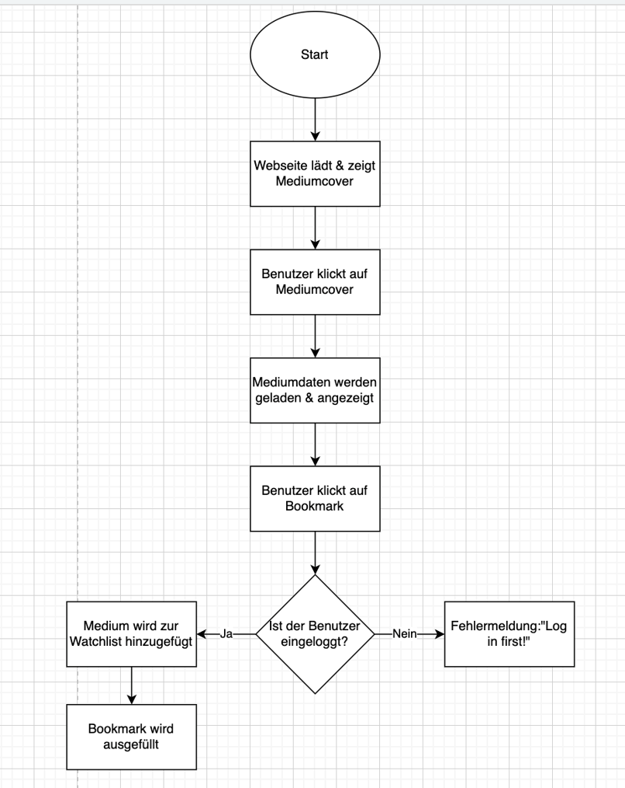
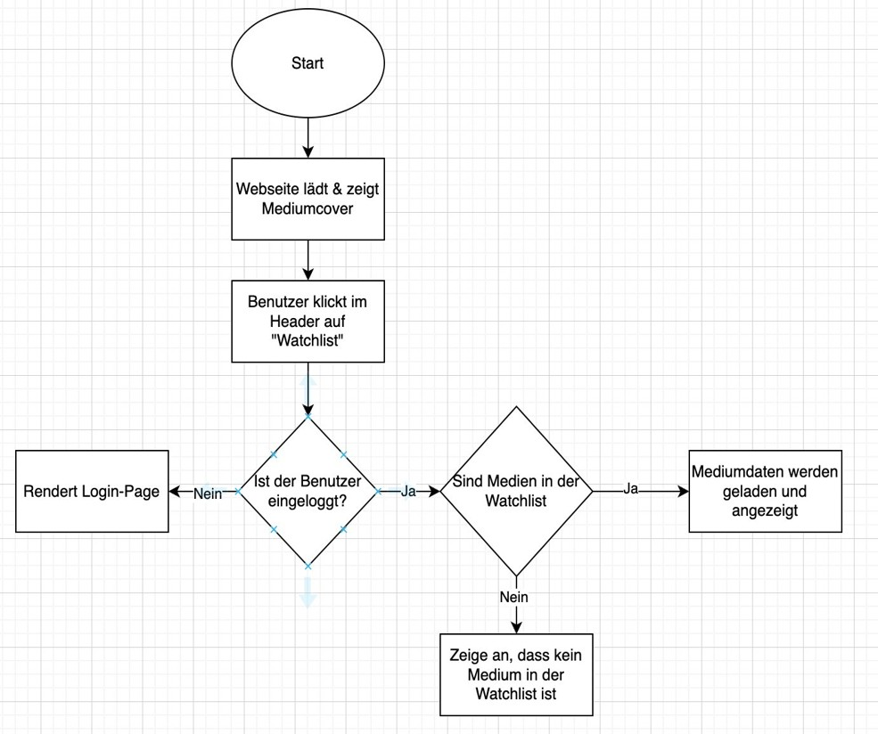
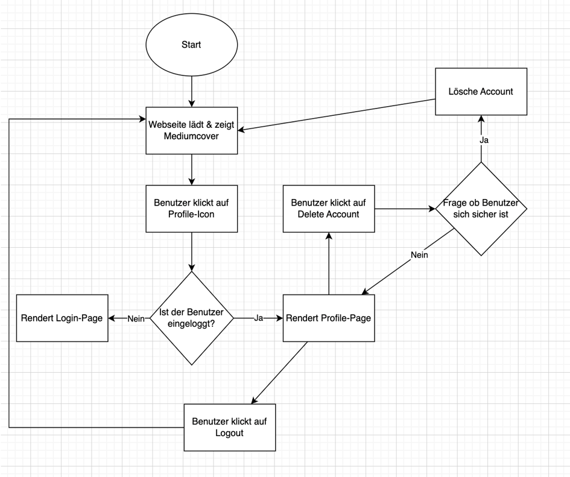
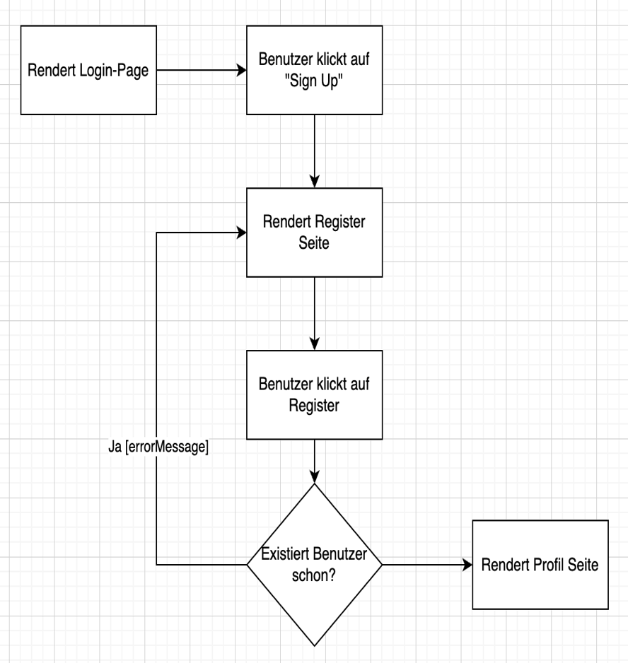

# Dokumentation: Entwurf und Umsetzung der Web-Applikation "CineCanvas"

## Inhaltsverzeichnis
1. Einleitung
2. Entwurf der Applikation
2.1 Ideensammlung und Zielsetzung
2.2 Konzept und Featureauswahl
3. Technische Umsetzung
3.1 Architektur
3.2 Ordnerstruktur
3.3 Implementierung der Serverlogik
3.4 Benutzeroberfläche und Interaktivität
4. Quelltext Beispiele
4.1 Index.pug
4.2 Datenmodellierung
4.3 toggle-watchlist API
5. Problembehandlung und Testphase
5.1 Problembehandlung
5.2 Testphase und Fehlerbehebung
5.3 Finalisierung
6. Quellen und Hilfsmittel-Verzeichnis
6.1 Verwendete Hilfsmittel
6.2 Quellenangabe
---

## 1. Einleitung

Diese Dokumentation beschreibt detailiert den Entwurf und die technische Umsetzung der Web-Applikation "CineCanvas". Die Applikation ermöglicht Nutzern Filme und Serien zu entdecken und ihre persöhnliche Watchlist zu verwalten - alles in einem Ort. Der Fokus liegt dabei auf einer benutzerfreundlichen und intuitiven Benutzeroberfläche, die auf verschiedenen Geräten nutzbar ist.

---

## 2. Entwurf der Applikation
### 2.1 Ideensammlung und Zielsetzung

Zu Beginn des Projekts haben wir ein Brainstorming durchgeführt, um die Kernfunktionen und den Umfang der Applikation zu definieren. Diese sind als folgende Ziele formuliert:
- **Medienkatalog für Filme und Serien**: Filme und Serien sollen nach Ranking und nach Alphabet sortiert sein
- **Detailansicht**: Beim Klick auf ein Film oder eine Serie öffnet sich eine detaillierte Ansicht mit weiteren Informationen
- **Benutzerverwaltung**: Registrierung, Anmeldung, Profilansicht und persönliche Watchlist als Funktionen
- **Watchlist-Verwaltung**: Filme & Serien hinzufügen und entfernen sowie Detailansicht anzeigen lassen
- **Responsive Design**: Web-Applikation passt sich dynamisch an verschiedene Bildschirmgrößen (Laptop, Tablet, Handy) an

### 2.2 Design
Das Design von "CineCanvas" setzt auf eine minimalistische und klare Struktur. Mit der übersichtlichen Navigationsbar wird ein schneller Zugriff zur Übersicht, Ranking, Watchlist und zum Profil ermöglicht.

Erstes Konzept:


```
Navigationbar
```
```
Movies
 x    y    z


Series
 x    y    z


```
```
Footer
```

---

## 3. Technische Umsetzung
### 3.1 Architektur

Die Applikation wurde unter Verwendung des Model-View-Controller (MVC)-Architekturmodells entwickelt. Diese Architektur trennt die Datenlogik (Model), die Darstellung (View) und die Anwendungslogik (Controller), um die Wartbarkeit und Skalierbarkeit der Anwendung zu verbessern.

**Model (Datenmodell)**: Enthält alle Informationen zu Filmen, Serien und Benutzern, gespeichert in JSON-Dateien
**View (Benutzeroberfläche)**: Stellt die Daten unter Verwendung von Pug und CSS dar
**Controller (Logik)**: Verwaltet die Anfragen des Nutzers, greift auf das Model zu und übergibt die Daten an die View

`Diagrammbeispiele:`
<table>
  <tr>
    <td>
      
    </td>
    <td>
      
    </td>
  <tr>
  <tr>
    <td>
      
    </td>
    <td>
      
    </td>
  <tr>
</table>


### 3.2 Ordnerstruktur
Die Web-Applikation folgt einer strukturierten Ordnerorganisation, die die Trennung der verschiedenen Bereiche aufzeigt. Die Ordnerstruktur sieht wie folgt aus:
```
/src
  /data                 // JSON-Daten für Filme, Serien und Benutzer
  /public               // Statische Dateien (CSS, Bilder, JavaScript)
    /icon               // Icon-Dateien
    /img                // Medienbilder & ImageViews
       /moviecovers     // Bilder für Filmcovers
       /seriescovers    // Bilder für Seriencovers
    /scripts            // JavaScript für interaktive Funktionen
    /styles             // CSS-Dokument
  /views                // Pug-Templates für die HTML-Ausgabe
  server.js             // Haupt-Server-Datei (Controller)
```

### 3.3 Implementierung der Serverlogik
Die `server.js`-Datei enthält die komplette Serverlogik und verwendet das **Express.js** Framework für die Erstellung des Webservers. Folgende Funktionalitäten werden umgesetzt:

* **Routing**: Übersichtliche und strukturierte Definition von Routenwelche auf Pug-Templates zurückgreifen:
    + Öffentliche Routen
    + Benutzerauthentifizierung
    + Watchlist-Verwaltung
* **Middleware**: Die Middleware ermöglicht eine reibungslose Kommunikation zwischen Client und Server, indem sie Anfragen vor der Verarbeitung vorbereitet und zusätzliche Funktionalitäten bereitzustellen:
    + Body-Parser
    + Express-Session
    + Static Files
* **Datenbankanbindung**: Die Anwendung verarbeitet Daten und die API-Logik stellt sicher, dass Benutzerinteraktionen direkt reflektiert und in JSON-Dateien gespeichert werden:
    + Laden und Speichern von Daten
    + Dynamische Aktualisierung

### 3.4 Benutzeroberfläche und Interaktivität

Die Benutzeroberfläche wurde mit Pug für dynamische HTML-Generierung und CSS für das Design entwickelt. Interaktive Funktionen wurden mit JavaScript umgesetzt. Zu den interaktiven Features gehören:

- **Modal-Fenster**: Beim Klicken auf ein Medium wird ein Modal-Fenster mit detaillierten Informationen angezeigt
- **Benutzerverwaltung**: Nutzer können sich registrieren, anmelden und ihr Profil anzeigen lassen. Als angemeldeter Nutzer ist die Funktion der Watchlist-Verwaltung nutzbar.
- **Watchlist-Verwaltung**: Nutzer können Medien per Klick zur Watchlist hinzufügen oder entfernen, unterstützt durch die Fetch API

---

## 4. Quelltext - Beispiele
### 4.1 Index.pug
Index.pug ist die Startseite und lädt die wichtigsten Komponenten für Filme und Serien. PUG ist eine Template-Engine um HTML-Seiten effizient und übersichtlicher zu machen. Index.pug erweitert das Layout aus `layout.pug` um das Grundgerüst der Seite beizubehalten.
Innerhalb des `content`-Blocks werden die Filme und Serien in Sektionen für monatliches Film- und Serienranking aufgeteilt, wobei die Inhalte aus `movie.pug` und `series.pug` eingebunden.
Zusätzlich wird ein Modal-Fenster aus `modal.pug`integriert welches Details anzeigt.
````pug
extends layout.pug

block content
  .bodyContainer.marginLeftLarge
    h2.blueFontColor.marginTopLarge Movie Ranking of the Month
    - var showRanking = true
    include movie.pug
    h2.blueFontColor.marginTopLarge Series Ranking of the Month
    - var showRanking = true
    include serie.pug

  include modal.pug
````

### 4.2 Datenmodellierung

Medien-, Serien- und Benutzerdaten werden in jeweils unterschiedlichen JSON-Dateien gespeichert. Jede Datei enthält ein Array von Objekten (`[]`) wobei jedes Objekt (`{}`) die passenden Informationen speichert. Bei dem Hinzufügen von Daten werden neue Objekte angelegt und beim Löschen wird das jeweilige Objekt entfernt.

Struktur der `users.json`-Datei:
```json
[
  {
    "firstName": "Max",
    "lastName": "Mustermann",
    "gender": "male",
    "email": "max.mustermann@example.com",
    "username": "maxi",
    "password": "geheimesPasswort",
    "movie-watchlist": [1, 3],
    "series-watchlist": [2]
  }
]
```
Struktur der `movies.json` -Datei:
```json
[
  {
    "id": 0,
    "title": "Filmname",
    "image": "img/moviecovers/filmCover",
    "ranking": 1,
    "description": "Filmbeschreibung",
    "genre": "Filmgenre",
    "director": "Filmregisseur",
    "released": "Filmpublikation"
  }
]
```

Die Struktur der `series.json`-Datei entspricht der `movei.json`-Datei.

### 4.3 toggleWatchlist
Der Code definiert eine Express-Route (`POST /toggle-watchlist`), die es eingeloggten Nutzern ermöglicht, Filme oder Serien zur persönlichen Watchlist hinzuzufügen oder zu entfernen. Als erstes wird geprüft, ob der Benutzer eingeloggt ist (`req.session.user`), andernfalls wird eine Fehlermeldung zurückgegeben. Anschließend wird die `users.json`-Datei ausgelesen, um den aktuellen Benutzer zu identifizieren. Es wird das passende Watchlist-Array des Nutzers gewählt, und die eindeutige ID des Films oder der Serie wird entweder hinzugefügt oder entfernt. Danach wird die aktualisierte Benutzerliste zurück in die JSON-Datei geschrieben. Die Route gibt eine Antwort mit dem aktuellen Stand der Watchlist zurück, um die Änderungen in der Benutzeroberfläche anzuzeigen.

```js
app.post('/toggle-watchlist', (req, res) => {
  if (!req.session.user) {
    return res.json({ success: false, message: 'Not logged in' })
  }

  const { mediaType, mediaId } = req.body
  const users = JSON.parse(fs.readFileSync('./data/users.json', 'utf8'))
  const currentUserIndex = users.findIndex(
    (u) => u.username === req.session.user.username,
  )

  if (currentUserIndex === -1) {
    return res.json({ success: false, message: 'User not found.' })
  }

  const currentUser = users[currentUserIndex]
  const watchlistKey =
    mediaType === 'movie' ? 'movie-watchlist' : 'series-watchlist'

  if (!currentUser[watchlistKey]) {
    currentUser[watchlistKey] = []
  }

  const index = currentUser[watchlistKey].indexOf(mediaId)

  if (index === -1) {
    currentUser[watchlistKey].push(mediaId)
  } else {
    currentUser[watchlistKey].splice(index, 1)
  }

  users[currentUserIndex] = currentUser
  fs.writeFileSync('./data/users.json', JSON.stringify(users, null, 2))

  res.json({ success: true, [watchlistKey]: currentUser[watchlistKey] })
})
```

---

## 5. Problembehandlung und Testphase
### 5.1 Problembehandlung
Während der Entwicklung der Web-Applikation kam es durch aus vor, dass wir auf Probleme trafen welche wir nicht ohne weiteres lösen konnten. Folgende Probleme sind unter anderem aufgetreten:

* **Navigationbar**:Da wir ein Responsive Design gewähren wollen, standen wir vor der Frage wie wir unsere Navigationbar auch auf kleinen Geräten anzeigen lassen können.
  + `Lösung:` Ab einer bestimmten Größe die "traditionelle" Navigationbar nicht mehr anzeigen. Dafür wird ein "3-Strich" -Menu angezeigt, welches per OnClick ein Dropdown-Menu anzeigt. Dieses hat die gleiche Navigationsoptionen wie die "traditionelle" Navigationsbar.
* **Watchlist**: Die Datenspeicherung in der Watchlist funktionierte zunächst nicht wie vorgesehen. Filme und Serien wurden nicht getrennt gespeichert, was dazu führte, dass sie nicht korrekt dargestellt wurden.
  + `Lösung:` Es wurde eine eindeutige ID für jeden Film und jede Serie hinzugefügt. Diese IDs werden getrennt nach Filmen und Serien als Werte in jeweils eigenen Eigenschaften eines Users gespeichert. Beim Aufruf der Watchlist werden die gespeicherten Film- und Serien-IDs des Nutzers geladen und entsprechend angezeigt. Dadurch wird sichergestellt, dass Filme und Serien korrekt voneinander unterschieden und dargestellt werden.

### 5.2 Testphase und Fehlerbehebung
Nach der Implementierung der grundlegenden Funktionen wurde die Applikation einer Testphase unterzogen. Hierbei wurden Fehler identifiziert und behoben. Außerdem wurden verschiedene Optimierungen auf Basis von Feedback umgesetzt:

- **UI-Verbesserungen**: Verbesserung des Layouts und der Benutzerführung
- **Responsive Design**: Kleinere Anpassungen um ein rundum unterstütztes Responsive Design zu gewähren
- **Fehlerbehebungen**: Behebung kleinerer Bugs in der Funktionalität
- **Optimierung der Performance**: Vereinfachung der Benutzerinteraktionen und Verbesserung der Ladezeiten
- **Clean Code**: Verschönerung des Codes

### 5.3 Finalisierung
Nach erfolgreichem Testen und dem Implementieren von Verbesserungen wurde die Applikation finalisiert. Es wurden keine Veränderungen mehr am Coding vorgenommen.

---
## 6. Quellen und Hilfsmittel-Verzeichnis

### 6.1 Verwendete Hilfsmittel
Für die Entwicklung wurden folgende Tools und Technologien verwendet:

- **Node.js**: Laufzeitumgebung für den Server
- **Express.js**: Web-Framework zur Erstellung des Servers und der Routen
- **PUG**: Template Engine zur dynamischen HTML-Erstellung
- **CSS**: Stylesheet-Sprache für das Design
- **JavaScript**: Clientseitige Interaktivität
- **JSON**: Datenmodellierung und Speicherung
- **Prettier**: Code-Formatierung und -Standardisierung
- **VS-Code**: Code-Editor
- **Github**: Versionskontrolle und Code-Hosting

### 6.2 Quellen
* **W3Schools - CSS**
  https://www.w3schools.com/css/ (17.02.2025)
* **Flexbox Froggy - CSS**
  https://flexboxfroggy.com/#de (07.02.2025)
* **MDN Web Docs - CSS**
  https://developer.mozilla.org/en-US/docs/Web/CSS (17.02.2025)
* **Erklärung und Anwendung von PUG**
  https://how.dev/answers/what-is-pug-syntax (13.02.2025)
* **Templates - PUG**
  https://devhints.io/pug (17.02.2025)
* **MDN Web Docs - JavaScript**
  https://developer.mozilla.org/en-US/docs/Web/JavaScript (21.02.2025)
* **W3Schools - JavaScript**
  https://www.w3schools.com/js/ (21.02.2025)
* **MDN Web Docs - Node.js & Express.js**
  https://developer.mozilla.org/en-US/docs/Learn_web_development/Extensions/Server-side/Express_Nodejs (16.02.2025)
* **Express JS Crash Kurs**
  https://www.youtube.com/watch?v=L72fhGm1tfE&ab_channel=TraversyMedia (16.02.2025)